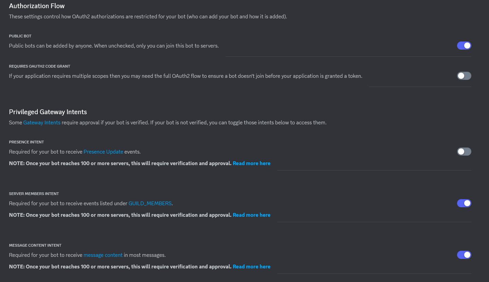
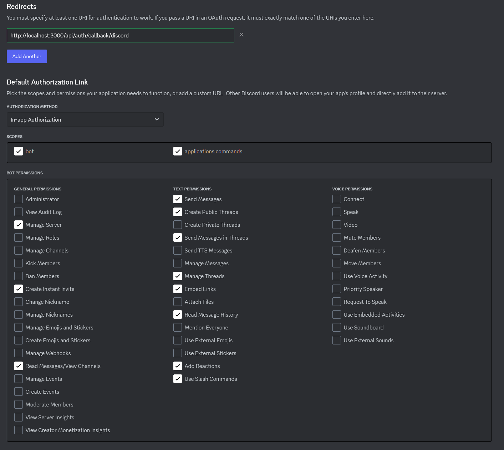

# Contributing

Thank you for your interest in contributing to Answer Overflow! If you need any help, please reach out in our [Discord](https://discord.answeroverflow.com/)!

## If I have a change I want to make, do I create a PR or an issue first?

Please create an issue first, this will help us manage release notes and workshop the issue you wish to address before moving forward

## Development workflow

We use developer containers to ensure a consistent environment across all platforms, it is up to you whether to use them or not and there are instructions for setting up with both.

We recommend the use of dev containers to make your onboarding as easy as possible, below are instructions for setup on both, pick one to follow (dev containers is recommended)

## Dev containers

Follow this [Getting Started Guide](https://code.visualstudio.com/docs/devcontainers/containers) on how to setup dev containers for your system

- If you encounter issues with installing packages, change the remote user from "node" to "root" in devcontainer.json
- If you are on Linux you may need to install docker compose separately, check out [Docker's page on how to do so](https://docs.docker.com/compose/install/linux/).

## Local Environment

We use [pnpm](https://pnpm.io) as our package manager, so make sure to [install](https://pnpm.io) it first.

Along with this, you will need to have a [MySQL Server](https://dev.mysql.com/downloads/installer/) running

And an [Elastic Search](https://www.elastic.co/guide/en/elasticsearch/reference/current/install-elasticsearch.html) server setup

## Remote Environment (Codespaces / Gitpod)

There are shortcut buttons in the README to jump start running from a remote environment. When running from these remote environments, consider the following:

- They require at least 8 GB of ram to run the databases
- If you have a slow remote machine, then the tests may fail when you run them locally if you run them all at the same time from the root directory.
  - Consider running the tests on at a time or configuring the DEFAULT_DELAY_IN_MS environment variable
- The work you're doing may not need any databases to be running (i.e UI work)
  - In this case, consider creating a smaller machine and just running the package you're developing in
  - This is only for packages that don't make any calls to the databases. If you try to run the tests on the whole project without databases setup the tests will fail

### Cloud Development Enviroment Env's

#### Github Codespaces Secrets

We recommend using [encrypted secrets](https://docs.github.com/en/codespaces/managing-your-codespaces/managing-encrypted-secrets-for-your-codespaces) while using [github codespaces](https://github.com/features/codespaces). This makes moving between different codespaces much quicker, removing the need to regenerate secrets for your .env file.

Please note, if you do not copy all the .env.example variables into your codespace secrets, you must still make a .env file from your .env.example file - otherwise you will have missing env variables!

#### Gitpod Secrets

If you are using gitpod, you should use [gitpod enviroment variables](https://www.gitpod.io/guides/automate-env-files-with-gitpod-environment-variables).

## UI

We use storybook for developing our components and pages. It offers an isolated environment with a powerful tool set to empower frontend development.

Notes:

- Creating a page? Make sure to use the `PageWrapper` as the parent element, this makes sure we keep styling the same across all our pages.

### Design

For more information on designing Answer Overflow UI's, check out our [Design Guidelines](./DESIGN_GUIDELINES.md).

### Gitpod

- You must start the databases using the command docker-compose up
- Use the localhost database urls provided in .env.example

### Codespaces

- I had issues making the 16 gb machine work, that's why it uses the 32 gb machine. If you can make the 16 gb machine work, please open an issue

## VSCode users

There is a workspace file called answeroverflow.code-workspace, VSCode lets you open this folder as that workspace and it is recommended that you do your development work inside of this workspace as it will configure all of the settings for you

! The workspace is set to hide all "useless" files (i.e node_modules) if you for some reason need to access them, comment out the line hiding them in the workspace file !

### Get it running

Copy the .env.example file in the root directory and create a new file titled .env

Follow the steps listed in .env.example to properly configure your environment variables

```bash
# in project root directory
pnpm install
pnpm db:push
pnpm db:wipe
pnpm dev
```

### Testing

```bash
# in project root directory
pnpm test

# to test an individual package:
cd [apps|packages]/[package_name] pnpm test:watch
```

### Linting

```bash
pnpm lint:fix
```

### Building

```bash
pnpm build
```

## Setting up your Developer Bot

Head to the [Discord Developer Portal](https://discord.com/developers/applications), and create a new application (call it something like "AO Dev Test"), and optionally a testing server in Discord.

In the portal, click "Bot" and add a bot.

Enable the following intents:

- `Server Members`
- `Message Content`

<div align="center">
  <figure>
    
  </figure>
</div>

You'll also want to copy your token, and save it someplace safe (like GitHub Secrets).

Next, in `OAuth2->General`, you'll want to grab your Client ID and Client Secret for safekeeping as well.

Add a redirect, and point it to `http://localhost:3000/api/auth/callback/discord` (if you're hosting on a VPS with Remote Environment, use your VPS IP in place of localhost)

Change the authorization method to "In-app Authorization", checking the `bot` and `applications.commands` scopes.

You'll want to enable the following bot permissions:

- `Manage Server`
- `Create Instant Invite`
- `Read Messages/View Channels`
- `Send Messages`
- `Create Public Threads`
- `Send Messages in Threads`
- `Manage Threads`
- `Embed Links`
- `Read Message History`
- `Add Reactions`
- `Use Slash Commands`

When you're done, it should look like this:

<div align="center">
  <figure>
    
  </figure>
</div>

You can then generate a link from `OAuth2->URL Generator` using the `bot` and `applications.commands`, with the same permissions.

Replace your ID in this link: `https://discord.com/oauth2/authorize?client_id=YOUR_ID&permissions=328565083201&scope=bot+applications.commands`

Or use the [Discord Permissions Calculator](https://discordapi.com/permissions.html).

Add your bot to the server with the link and begin testing from your development machine.

## Project overview

This project is a monorepo using Turborepo. In order to keep documentation up to date and accurate, please view the [README](./README.md) of the package that you are developing on.

## Style Guide

Formatting is mostly controlled by ESLint, here are a few misc things that aren't:

- snake_case for names
- camelCase for functions
- Colocate test files next to the files that they test, i.e file.ts & file.test.ts
- Destructure props passed into components / functions
