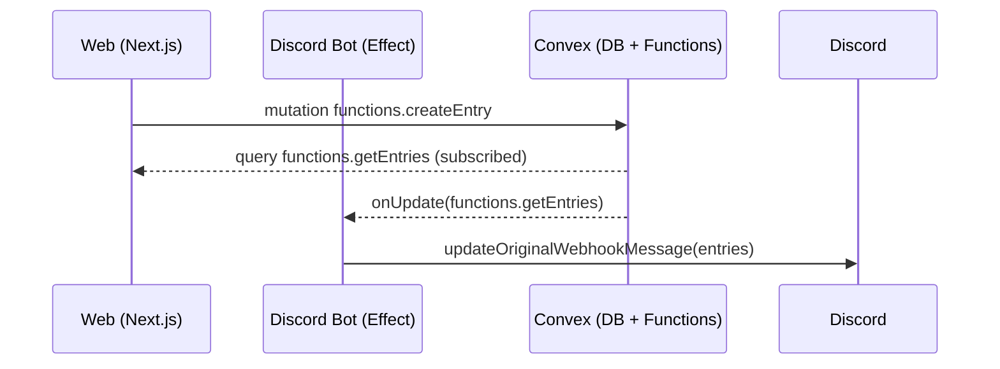

## Cross‑platform realtime monorepo

this readme was auto generated

This repository demonstrates how to use Next.js, Convex, Effect, and shadcn/ui together in a single monorepo to power realtime, cross‑platform experiences (web + a Discord bot) with a shared backend.

### Highlights

- **Next.js 15 + React 19**: App Router, Tailwind v4 UI.
- **Convex**: Realtime database, server functions, and generated clients.
- **Effect + DFX**: Reliable, typed Discord bot on Bun runtime.
- **shadcn/ui**: Reusable UI kit published as a local package.
- **Clerk**: Authentication for the web app.
- **Turborepo**: Orchestrates concurrent dev for web, backend, and bot.

### Monorepo structure

- `apps/web`: Next.js app using Clerk + Convex React client and shadcn/ui.
- `apps/discord-bot`: Effect + DFX Discord bot on Bun, consuming the Convex HTTP and realtime clients.
- `packages/convex`: Convex schema, functions, and a tiny shared client wrapper.
- `packages/ui`: shadcn/ui components, styles, and theming consumed by the web app.
- `packages/typescript-config`: Shared tsconfig presets.

## How realtime sync works

The shared `entries` model is defined in Convex. The web app reads/writes via Convex React hooks; the Discord bot uses an HTTP client plus a subscription for realtime updates.



Key pieces:

- Web uses `useQuery(api.functions.getEntries)` and `useMutation(api.functions.createEntry)` to render and mutate data.
- Bot imports `@packages/convex/client` to call `getEntries()` over HTTP and `onEntriesUpdated(...)` for push updates.
- Convex functions and schema live in `packages/convex/convex/` and are shared across all apps.

## Getting started

### Prerequisites

- Bun ≥ 1.2 (repo uses `packageManager: bun`)
- Node ≥ 18.8
- A Convex account and project
- A Clerk application (for web auth)
- A Discord Bot token (for the bot)

### 1) Install dependencies

```sh
bun install
```

### 2) Configure Convex

1. Start Convex locally (first run will guide you through auth/project creation):
   ```sh
   bun run --filter @packages/convex dev
   ```
2. In the Convex dashboard, set the environment variable `CLERK_ISSUER_URL` (from Clerk JWT Templates → "convex").

### 3) Create a root .env

Both the web and the bot load from the root `.env`.

```env
# Convex
CONVEX_URL=https://YOUR-CONVEX-DEPLOYMENT.convex.cloud
NEXT_PUBLIC_CONVEX_URL=${CONVEX_URL}

# Clerk (Web)
NEXT_PUBLIC_CLERK_PUBLISHABLE_KEY=pk_test_xxx
CLERK_SECRET_KEY=sk_test_xxx

# Discord Bot
DISCORD_BOT_TOKEN=your_discord_bot_token
```

Notes:

- `CLERK_ISSUER_URL` is configured in Convex (dashboard), not in this file.
- During local development, `CONVEX_URL` should match your dev URL from the Convex CLI output.

### 4) Run everything

```sh
bun run dev
```

This launches the web app, the Convex dev server, and the Discord bot together using Turborepo's TUI (use ↑/↓ to switch logs). You can change the TUI in `turbo.json`.

## Deploy

The web app is configured to deploy together with Convex. The build command used by Vercel (see `apps/web/vercel.json`) is:

```sh
cd ../../packages/convex && npx convex deploy --cmd 'cd ../../apps/web && turbo run build' --cmd-url-env-var-name NEXT_PUBLIC_CONVEX_URL
```

This ensures Convex is deployed first and the web app is built with the correct `NEXT_PUBLIC_CONVEX_URL`.

## Working with the stack

### shadcn/ui (in `packages/ui`)

- Components live in `packages/ui/src/components/*` with styles in `packages/ui/src/styles/globals.css`.
- Add new components using the shadcn CLI targeting the package:
  ```sh
  npx shadcn@latest add button --cwd packages/ui
  ```
- Import components in web as `@packages/ui/components/button`.

### Convex (in `packages/convex`)

- Schema: `convex/schema.ts` defines the `entries` table.
- Functions: `convex/functions.ts` exposes `createEntry`, `getEntries`, `removeEntry`.
- React client (web): `convex/react` via `ConvexProviderWithClerk`.
- Shared client (bot): see `packages/convex/client.ts` for HTTP + subscription helpers.

### Effect + DFX Discord bot (in `apps/discord-bot`)

- Bootstrapped with `BunRuntime.runMain` and Effect Layers.
- Reads entries via `getEntries()` and subscribes via `onEntriesUpdated(...)` to edit messages in place.
- Configure `DISCORD_BOT_TOKEN` and keep `CONVEX_URL` in your `.env`.

## Commands

- Root dev (all apps): `bun run dev`
- Web only: `bunx turbo run dev --filter web-app` (or `bun run dev -- --filter web-app`)
- Convex only: `bunx turbo run dev --filter @packages/convex` (or `bun run dev -- --filter @packages/convex`)
- Discord bot only: `bunx turbo run dev --filter discord-bot` (or `bun run dev -- --filter discord-bot`)

## FAQ

- Why Convex? Built‑in realtime, transactions, and generated types across server and client.
- Why Effect for the bot? Composable layers, typed effects, and resiliency (retries, schedules, structured logs).
- Why shadcn/ui in a package? Keeps UI primitives versioned, themed, and shareable across apps.

## License

MIT
