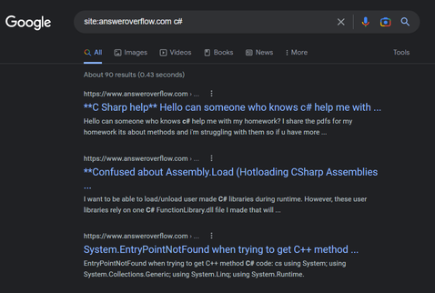

<a href='https://answeroverflow.com/' target="_blank" rel="noopener">
  <picture>
    <source media="(prefers-color-scheme: dark)" srcset="https://www.answeroverflow.com/AnswerOverflowLogoLight.png" />
    
  </picture>
</a>

  <h3>Index your discord help channels to google </h3>
  
  
   
  
  
   

   
   
  <figure>
  
    <figcaption>
      

        These results are from questions asked <strong>in Discord help channels</strong> and are now Google indexed so that they can be found by people searching for these questions
      

    </figcaption>
  </figure>

 

## Intro

Answer Overflow lets you index your Discord help channels into Google so that you can:

- Grow your community
- Stop answering repeat questions
- Improve the quality of life of people using your project

### Features

- 🔍&nbsp; Index questions into Google.
- 📈&nbsp; Powerful analytics - Learn what questions are asked the most, who is most helpful, and other community insights
- ✅&nbsp; Improved Help Channels - Mark questions as solved, organize content, and keep discussions on track
- 🐻&nbsp; Easy - Simple menus to control settings

### Roadmap

- 🤖&nbsp; AI question improvement suggestions trained on your community
- 🤖&nbsp; AI answers trained off of your community
- 🗺️&nbsp; Server browser and discoverability
- ✈️&nbsp; Self Hosting Support
- 📥&nbsp; Automatically redirecting people to correct help channels

## Quickstart

Go to [Answer Overflow](https://www.answeroverflow.com/), add the bot your server, and use /channel-settings to get started

## Star History

## Contributing

Want to contribute? First, read the <a href="https://github.com/AnswerOverflow/AnswerOverflow/blob/main/CONTRIBUTING.md">Contributing Guidelines</a> before creating PRs or issues. Need any help? Join us on <a href="https://discord.gg/Wny38ap7Tx">Discord</a>!

For designing user interfaces, check out our [design guidelines](./DESIGN_GUIDELINES.md).

  

  
  

  

    
  

  <a href="./CONTRIBUTING.md">
    Remote development tips
  </a>

### All contributors ✨

> Answer Overflow is developed by [Rhys Sullivan](https://twitter.com/RhysSullivan)

<a href="https://github.com/AnswerOverflow/AnswerOverflow/graphs/contributors">
  

    
  

</a>
