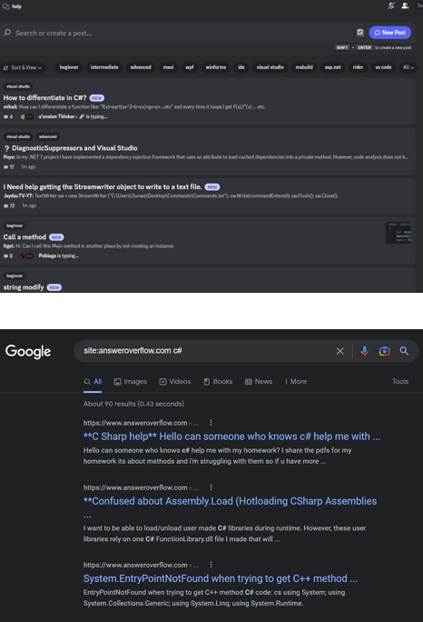

  <h1>Answer Overflow</h1>
  <h3>Google Index Your Discord Help Channels </h3>
  
  
   
  
  
   
   
   
  <figure>
  
    <figcaption>
      

        These results are from questions asked <strong>in Discord help channels</strong> and are now Google indexed so that they can be found by people searching for these questions
      

    </figcaption>
  </figure>

 

## Intro

Answer Overflow lets you index your Discord help channels into Google so that you can:

- Grow your community
- Stop answering repeat questions
- Improve the quality of life of people using your project

### Features

- 🔍&nbsp; Index questions into Google.
- 📈&nbsp; Powerful analytics - Learn what questions are asked the most, who is most helpful, and other community insights
- ✅&nbsp; Improved Help Channels - Mark questions as solved, organize content, and keep discussions on track
- 🐻&nbsp; Easy - Simple menus to control settings

## Quickstart

Go to [Answer Overflow](https://www.answeroverflow.com/), add the bot your server, and use /channel-settings to get started

## Star History

## All contributors ✨

> Answer Overflow is developed by [Rhys Sullivan](https://twitter.com/RhysSullivan)

Want to contribute? First, read the <a href="https://github.com/AnswerOverflow/AnswerOverflow/blob/main/CONTRIBUTING.md">Contributing Guidelines</a> before creating PRs or issues. Need any help? Join us on <a href="https://discord.gg/Wny38ap7Tx">Discord</a>!

<a href="https://github.com/AnswerOverflow/AnswerOverflow/graphs/contributors">
  

    
  

</a>
